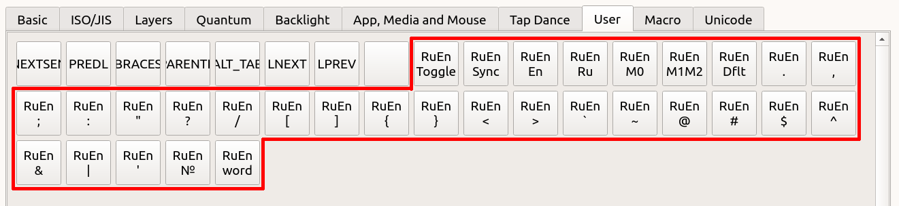

# Режим RuEn

Этот режим предназначен для того, чтобы

- расположить знаки пунктуации в одних и тех же местах для русского и английского языка,
- вводить символы из английской раскладки при печати в русской,
- переключать раскладку на английскую или русскую отдельными клавишами.

Это работает благодаря тому, что клавиатура помнит текущую раскладку, и при необходимости ввести символ, отсутствующий в русской раскладке, временно переключает язык.

Основное достоинство такого подхода заключается в том, что нет необходимости устанавливать в систему дополнительное ПО или нестандартные раскладки. 

Основной недостаток: необходимость поддерживать одинаковое состояние раскладки в клавиатуре и в системе. Подробнее о том, как это обеспечить будет рассказано ниже.

Клавиши режима RuEn можно найти в программе Vial во вкладке User. Все клавиши этого режима начинаются со слова RuEn.

## Предварительная настройка

Ниже описаны несложные процедуры для предварительной настройки операционной системы и клавиатуры для работы режима RuEn. Если вы первый раз настраиваете RuEn, рекомендуется пройти по этому пути. 

Тем не менее, в некоторых случаях настройки по умолчанию могут вам не подойти:
- если у вас в системе используется нестандартное сочетание клавиш для смены раскладки, смотрите секцию [RuEn M0](#ruen-m0) и [RuEn M1M2](#ruen-m1m2);
- если вы много работаете с удаленными машинами (например, по RDP) и вам необходимо синхронизировать их раскладку с раскладкой клавиатуры, смотрите секцию [RuEn M1M2](#ruen-m1m2);
- если вам необходимо иметь для каждого окна индивидуальную раскладку или если у вас часто по какой-либо причине происходит рассинхронизация раскладки клавиатуры и системы, смотрите секцию [Использование программы qmk-hid-host](#использование-программы-qmk-hid-host).

### Windows

Особой предварительной настройки не требуется. Нужно убедиться, что
- сочетание клавиш `Win+Space` действительно переключает раскладку (для Windows 8 и новее такое должно быть по умолчанию),
- не используется индивидуальная раскладка для каждого окна.

## Linux

Нужно убедиться, что 
- сочетание клавиш `Win+Space` действительно переключает раскладку (для Ubuntu такое включено по умолчанию, для других дистрибутивов может потребоваться настройка),
- не используется индивидуальная раскладка для каждого окна.

## Mac

Нужно выполнить следующие действия:
- установить для русского раскладку Russian PC,
- выбрать способ переключения `Ctrl+Space`,
- включить на клавиатуре режим Mac (по умолчанию на месте клавиши `B` в желтом слое, она же кнопка `Toggle Ctl Gui` из вкладки Quantum программы Vial).

## Переключение раскладки

Чтобы клавиатура в нужный момент переключала раскладку, нужно чтобы раскладка клавиатуры совпадала с раскладкой в системе. Для этого

### RuEn Sync

### RuEn Toggle

### RuEn En / RuEn Ru

## Настройки способа переключения

### RuEn Dflt

### RuEn M0

### RuEn M1M2

## Дополнительные возможности

### Использование программы qmk-hid-host

### Режим CAPS WORD

### Режим RuEn word

### Ввод Unicode-символов

## Дополнительные ссылки и благодарности

- спасибо всем активным пользователям [телеграм-чата Ergohaven](https://t.me/+E-mlq11c97AyZmY6), помогающим отладить и улучшить режим RuEn
- режим RuEn во многом основан на идеях [lang_shift](https://github.com/klavarog/lang_shift), автор которого также написал [интересный лонгрид о создании своей раскладки](https://optozorax.github.io/p/my-keyboard-layout/)
- спасибо автору [qmk-hid-host](https://github.com/zzeneg/qmk-hid-host) за идею и реализацию программы, позволяющую синхронизировать раскладку (и не только!) клавиатуры и операционной системы
- [Universal Layout](https://github.com/braindefender/universal-layout) альтернативный способ решения той же проблемы ввода английских символов в русской раскладке, рекомендуется в том случае, если по какой-либо причине не подошел режим RuEn
